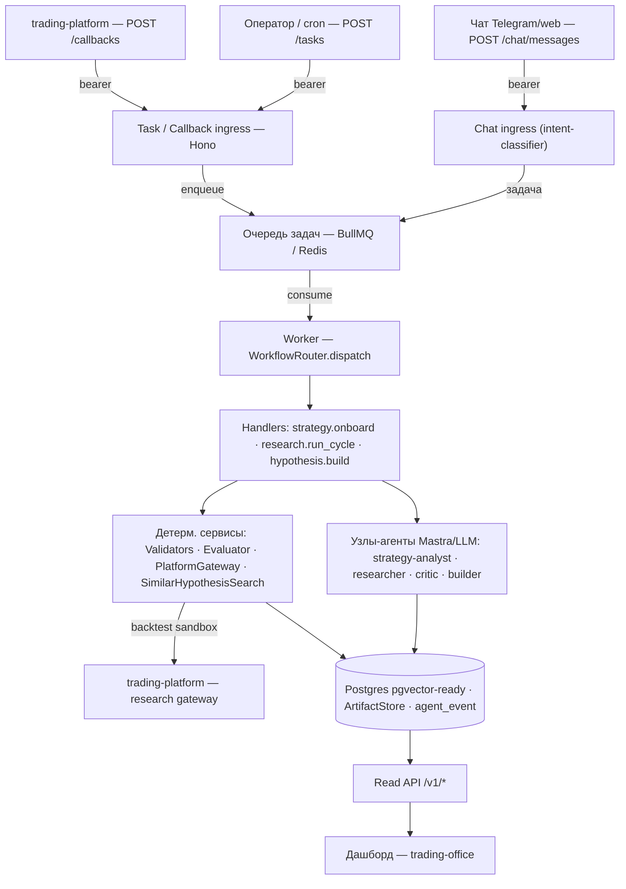
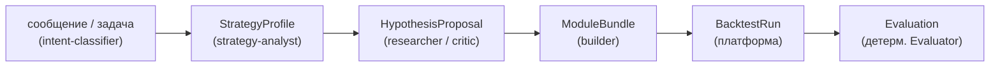
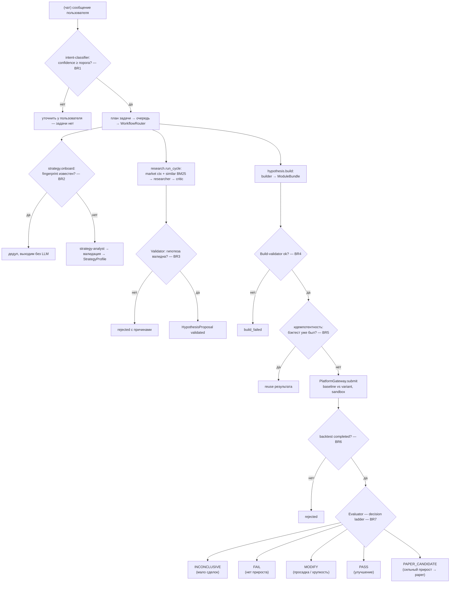

# Trading Lab


**AI-агент для исследования торговых стратегий.** Система-«исследовательский мозг»
над торговой платформой: она онбордит стратегию, выдвигает и проверяет гипотезы о том,
как её улучшить, генерирует код-варианты, прогоняет бэктесты в песочнице платформы и
выносит по каждому варианту решение — стоит ли отдавать его дальше, на paper-проверку.

> ⚠️ **Research-only. Агент ничего не торгует вживую** и физически не может разместить ордер
> (в системе нет execution-адаптера). Любое изменение в реальном боте проверяет и одобряет
> человек. Сгенерированный агентом код тоже не исполняется внутри trading-lab — его запускает
> только изолированная песочница торговой платформы.

Дипломный проект курса по инженерии AI-агентов. Стек — **TypeScript + [Mastra](https://mastra.ai)**
(аналог LangGraph для Node), оркестрация через очередь, хранение в Postgres.

---

## Статус (что готово / что доделывается)

| Блок | Статус |
|------|--------|
| Многоагентное ядро (5 агентов на Mastra) | ✅ готово |
| Нелинейная оркестрация, точки ветвления | ✅ готово (7 точек ветвления) |
| ≥3 инструмента, ≥1 внешний | ✅ готово (5 портов, 2 внешних) |
| HTTP API + CLI для запуска/демо | ✅ готово |
| 115 файлов тестов (Vitest), детерм. ассерты + проверка tool-вызовов | ✅ готово |
| Обоснование «почему агент» и «почему без RAG» | ✅ в этом README |
| Security-чеклист | ✅ в этом README |
| Единый `docker compose` (demo / local / vps) | ✅ готово (весь стек + дашборд одной командой) |
| Бенчмарк ≥10 запросов (input/expected) + success rate | 🟡 в разработке (методология ниже) |
| Eval: LLM-as-judge | 🟡 в разработке (ассерты и проверка tool-вызовов уже есть) |
| Observability через **Phoenix** (трейсы) | 🟡 coming soon (есть append-only `agent_event` audit-лог; seam под трейсинг подготовлен) |
| Метрики latency p95 / cost per run / success rate | 🟡 будут измерены после бенчмарка и Phoenix |

Незавершённые блоки помечены 🟡 и описаны ниже вместе с методологией — они доделываются.

---

## Содержание

1. [Что делает агент](#что-делает-агент)
2. [Инженерный контекст: 6 вопросов проектирования](#инженерный-контекст-6-вопросов-проектирования)
3. [Архитектура](#архитектура)
4. [Как взаимодействуют агенты](#как-взаимодействуют-агенты)
5. [Граф и точки ветвления](#граф-и-точки-ветвления)
6. [Дашборд (trading-office)](#дашборд-trading-office)
7. [Инструменты (tools)](#инструменты-tools)
8. [RAG — почему пока не нужен](#rag--почему-пока-не-нужен)
9. [Запуск и демонстрация](#запуск-и-демонстрация)
10. [Качество: тесты, бенчмарк, eval, метрики](#качество-тесты-бенчмарк-eval-метрики)
11. [Observability (Phoenix)](#observability-phoenix)
12. [Security-чеклист](#security-чеклист)
13. [Структура проекта](#структура-проекта)

---

## Что делает агент

trading-lab принимает торговую стратегию и её историю сделок и автоматически ведёт
**исследовательский цикл улучшения**: анализирует, где стратегия теряет деньги, выдвигает
гипотезы об изменениях, валидирует их, собирает из прошедших гипотез код-варианты, прогоняет
бэктест «базовая версия против варианта» на песочнице торговой платформы и по каждому
результату выносит детерминированное решение
(`PASS` / `MODIFY` / `FAIL` / `INCONCLUSIVE` / `PAPER_CANDIDATE`).

**Результат работы** — долговечный архив гипотез с решениями, метриками бэктестов и ссылками
на артефакты (Postgres + content-addressable хранилище), а также поток событий
(`agent_event`), по которому видно каждое решение агента. Сильные кандидаты помечаются
`PAPER_CANDIDATE` — их человек может отправить на paper-проверку.

---

## Инженерный контекст: 6 вопросов проектирования

Это ответы на вопросы, которые инженер задаёт себе, проектируя агента под прод.

### 1. Какую задачу решает агент?
Автоматизирует рутинную часть исследования торговых стратегий: от «вот стратегия и её убытки»
до «вот проверенные бэктестом кандидаты на улучшение с обоснованием». Снимает с человека
ручной перебор гипотез и прогон бэктестов, оставляя ему только финальное решение.

### 2. Кто будет пользоваться агентом?
Основной пользователь — **исследователь/квант-инженер** торговой команды (в т.ч. сам автор).
Точки входа: чат (`/chat/messages`, через дашборд `trading-office` — Telegram/web), оператор и
`cron` (`/tasks`), а также сама платформа (callback по завершении бэктеста). Браузер никогда не
ходит в trading-lab напрямую — только через бэкенд-дашборд.

### 3. С какими внешними системами и данными работает агент?
- **Торговая платформа** (`trading-platform`) — read-only рыночные данные/режим рынка, запуск
  бэктестов и песочница. Доступ через MCP-gateway (вендоренный `@trading-platform/sdk`).
- **Postgres** (`pgvector`-ready) — источник истины: профили стратегий, гипотезы, бэктесты,
  оценки, append-only audit-лог.
- **Redis (BullMQ)** — очередь задач между ingress и worker.
- **Файловое хранилище артефактов** (локально или S3) — equity-кривые, бандлы, логи решений.
- **LLM-провайдеры** — Anthropic / OpenAI / OpenRouter (через AI SDK).

### 4. Почему именно агент, а не обычный пайплайн?
Задача **исследовательская**: детерминированный workflow умеет посчитать метрики, но не умеет
решать, *что попробовать дальше*. Агенту приходится:
- по найденным убыткам **выдвигать гипотезы** и **выбирать**, какие вообще стоит проверять;
- **адаптироваться к результатам**: если набор гипотез не прошёл — менять направление поиска;
- **генерировать код** варианта стратегии под конкретную гипотезу (open-ended задача, не шаблон);
- **классифицировать намерение** пользователя из свободного текста в чате и спланировать задачу;
- понимать, **когда остановиться** (ограниченная автономия: лимиты, явные причины остановки).

При этом систему мы построили как **гибрид**: LLM-агенты живут «в узлах» графа и делают
ровно ту работу, где нужно суждение (анализ, гипотезы, код, критика, классификация), а
**оркестрация, гейты валидации и финальная оценка — детерминированный код**. Это осознанное
инженерное решение: открытое суждение отдаём модели, а корректность, безопасность,
идемпотентность и воспроизводимость держим в коде. Так агент остаётся гибким, но его решения
проверяемы и повторяемы — критично для прод-системы, принимающей решения о деньгах.

### 5. Какие сложные / нестандартные ситуации ожидаем (edge cases)?
| Ситуация | Как обрабатывается |
|----------|--------------------|
| Та же стратегия онбордится повторно | Дедуп по `sourceFingerprint` — пропускаем LLM-вызов, возвращаем существующий профиль (идемпотентность) |
| LLM выдал невалидную/«фантазийную» гипотезу (фичи вне каталога, lookahead, дубль) | Детерминированный валидатор отклоняет с причинами, до бэктеста; ничего не ломается |
| Builder сгенерировал нерабочий код | Build-validator (fast-fail: синтаксис, импорты, манифест, bundle-hash) → статус `build_failed` |
| Повторный запрос того же бэктеста | Идемпотентность по `(hypothesis_id, params_hash, bundle_hash)` — переиспользуем результат, не шлём дубль на платформу |
| Внешняя платформа недоступна / таймаут / несовпадение контракта | Fail-closed: ненулевой выход, бэктест помечается отклонённым; runtime-boot платформу не дёргает |
| Слишком мало сделок в бэктесте для вывода | Evaluator возвращает `INCONCLUSIVE`, а не ложный `PASS` |
| Неуверенная классификация намерения в чате | Порог `INTENT_CLASSIFIER_MIN_CONFIDENCE` — ниже него задача не планируется |
| Нет ключей LLM | Адаптеры по умолчанию `fake` — система поднимается и демонстрируется без ключей |

### 6. Как поймём, что агент работает хорошо? (критерии)
| Критерий | Приемлемый порог | Как меряем |
|----------|------------------|------------|
| **Success rate** на бенчмарке (≥10 запросов) | ≥ 80% «ожидаемый ↔ фактический» (валидное решение/маршрут) | прогон бенчмарка + eval-кейсы (см. ниже) |
| **Корректность tool-вызовов** | 100% задач дают ожидаемую последовательность `agent_event` (started → completed, без лишних side-effects) | проверка audit-трейла в тестах |
| **Latency p95 / cost per run** | p95 ≤ 30 c на цикл в `fake`-режиме; cost логируется на каждый прогон | будет измерено через Phoenix-трейсы (🟡) |

---

## Архитектура

Слоистая архитектура по принципу **ports & adapters** (гексагональная):

```
src/
├── domain/        # доменные типы: StrategyProfile, HypothesisProposal, BacktestRun, Evaluation
├── ports/         # интерфейсы (PlatformGateway, ResearchPlatform, ArtifactStore, TaskQueue, ...)
├── adapters/      # реализации портов (mock / mcp / bullmq / postgres / local-file / ...)
├── mastra/        # композиция Mastra: 5 агентов + единый `new Mastra({ agents })`
│   └── agents/    # strategy-analyst, researcher, critic, builder, intent-classifier
├── orchestrator/  # WorkflowRouter + handlers (strategy-onboard / research-run-cycle / hypothesis-build)
├── validation/    # детерминированные валидаторы + Evaluator (decision ladder)
├── ingress/       # HTTP API (Hono): POST /tasks, /callbacks, /chat/messages
├── chat/          # чат-ingress: классификация намерения + планирование задачи
├── read-api/      # read-only API (/v1/*) — поток agent_event для дашборда
├── worker/        # потребитель очереди (BullMQ)
├── auth/          # bearer-токены (fail-closed)
├── db/            # Drizzle ORM схема + миграции (Postgres)
└── config/        # загрузка окружения
```

Ключевые технологии: **Mastra `@mastra/core`** (агенты), **Hono** (HTTP), **BullMQ/Redis**
(очередь), **Drizzle ORM + Postgres** (хранение), **Zod** (валидация), вендоренный
**`@trading-platform/sdk`** (интеграция с платформой по MCP). Node исполняет TypeScript напрямую
(`--experimental-transform-types`), без отдельного шага сборки.

Сквозной путь запроса — от внешнего входа через ingress, очередь и worker до агентов,
детерминированных сервисов и хранилища:



### WorkflowRouter — как устроена оркестрация

`WorkflowRouter` — тонкий **детерминированный диспетчер задач** (без бизнес-логики и без вызовов
LLM). Worker достаёт из очереди конверт задачи `{ taskId, taskType, correlationId, payload,
dedupeKey }` и передаёт его в `router.dispatch(task, services)`. Роутер по полю `taskType`
выбирает зарегистрированный handler:

| `taskType` | handler | что делает |
|------------|---------|------------|
| `strategy.onboard` | `strategyOnboardHandler` | строит и сохраняет `StrategyProfile` |
| `research.run_cycle` | `researchRunCycleHandler` | генерирует и валидирует гипотезы |
| `hypothesis.build` | `hypothesisBuildHandler` | собирает вариант → бэктест → оценка |

Ключевые свойства:
- **Инверсия зависимостей.** Роутер прокидывает в handler готовый набор сервисов (порты:
  репозитории, `PlatformGateway`, `ArtifactStore`, агенты Mastra). Handler не создаёт зависимости
  сам — поэтому в тестах он получает mock/in-memory реализации без изменения кода.
- **Side-effect'ы принадлежат коду, а не модели.** Запись в Postgres, сабмит бэктеста, эмиссия
  `agent_event` — всё это делает handler детерминированно; LLM-агент только возвращает
  структурированный результат, который дальше проверяет код.
- **Каждый handler — явная цепочка шагов с decision-гейтами** (см. граф ниже): валидация,
  идемпотентность, оценка. Ветвления видны в коде, а не спрятаны внутри модели.
- **Fail-closed.** Неизвестный `taskType` → задача отклоняется, а не выполняется «как-нибудь».

Почему так, а **не Mastra-workflow-граф**: оркестрацию из обычного детерминированного TypeScript
проще тестировать, делать идемпотентной и воспроизводимой, а LLM подключается только там, где
действительно нужно суждение.

---

## Как взаимодействуют агенты

В системе **5 LLM-агентов** (Mastra). Важная деталь: **агенты не вызывают друг друга напрямую** —
они общаются через очередь задач и общие доменные объекты в Postgres. Это держит связи слабыми и
делает каждый шаг отдельно тестируемым.

| Агент | Где работает | Что делает |
|-------|--------------|------------|
| **intent-classifier** | chat-ingress | классифицирует свободный текст пользователя → планирует тип задачи |
| **strategy-analyst** | handler `strategy.onboard` | по исходнику стратегии строит `StrategyProfile` |
| **researcher** | handler `research.run_cycle` | по профилю + рыночному контексту + похожим прошлым гипотезам генерирует `HypothesisProposal[]` |
| **critic** *(опционально)* | handler `research.run_cycle` | ревьюит/критикует гипотезы перед валидацией |
| **builder** | handler `hypothesis.build` | генерирует код-вариант стратегии (`ModuleBundle`) под гипотезу |

Поток данных между агентами — это цепочка персистентных доменных объектов; в скобках указан агент
или сервис, который её создаёт:



---

## Граф и точки ветвления

Курс требует нелинейность минимум с двумя точками ветвления — у нас их **семь**. Ниже —
жизненный цикл задачи; `BR n` помечает точки, где маршрут зависит от контекста (ромбы — решения).



**Точки ветвления:**
1. **BR1 — Уверенность классификатора** — ниже порога задача не планируется.
2. **BR2 — Дедуп онбординга** — известный fingerprint → без LLM (идемпотентность).
3. **BR3 — Гейт валидации гипотез** — невалидные отклоняются с причинами.
4. **BR4 — Результат сборки** — нерабочий код → `build_failed`.
5. **BR5 — Идемпотентность бэктеста** — уже считали → reuse, без дубля на платформу.
6. **BR6 — Статус бэктеста** — не `completed` / нет сравнения → отклонить.
7. **BR7 — Лестница Evaluator** — 5-исходное детерминированное решение.

---

## Дашборд (trading-office)

Наблюдать за работой агента можно через дашборд из соседнего репозитория
**[trading-office](https://github.com/alexnikolskiy/trading-office)** — это отдельный сервис
(UI + backend-gateway). Браузер ходит только в office-backend, а тот проксирует read-only API
trading-lab (`/v1/*`, поток `agent_event`) — сам trading-lab наружу не торчит (см. раздел
[Security](#security-чеклист)).

Дашборд визуализирует мультиагентную систему как «офис»: каждый агент — сотрудник за своим столом
(Analyst, Researcher, Builder, Critic, Evaluator, Monitor), а его активность видна в реальном
времени по потоку событий `agent_event`.


> Дашборд поднимается вместе с агентом одной командой через единый `docker compose`
> (см. [Запуск](#запуск-и-демонстрация)).

---

## Инструменты (tools)

Агент работает не только с текстом — у него **5 портов** (инструментов) к внешней среде,
из них **2 внешних** (сетевые/межсервисные). Реализованы по схеме ports & adapters, что
позволяет подменять реализацию (mock для демо/тестов, реальную — в проде).

| Инструмент (порт) | Что делает | Внешний? |
|-------------------|------------|----------|
| **PlatformGateway** | рыночные данные, режим рынка, запуск бэктеста и получение результата | ✅ да — `trading-platform` |
| **ResearchPlatform** | discovery возможностей платформы, список датасетов, валидация модуля (MCP) | ✅ да — `trading-platform` gateway |
| **ArtifactStore** | content-addressable хранилище (sha256) для бандлов/кривых/логов | файловая система / S3 |
| **TaskQueue** | постановка и потребление задач | ✅ да — Redis (BullMQ) |
| **SimilarHypothesisSearch** | поиск похожих прошлых гипотез (сейчас BM25, pgvector — в планах) | локально (in-memory) |

Адаптеры по умолчанию — `mock`/`fake`/`in-memory`, поэтому демо поднимается без ключей и без
запущенной платформы. Реальная интеграция включается переменными окружения.

---

## RAG — почему пока не нужен

**RAG в текущей версии не используется — и это осознанное решение.**

Источник истины в системе — **таблицы Postgres** (профили, гипотезы, бэктесты, оценки), а не
векторный индекс. Память/поиск — *производные* данные, вспомогательные, а не канонические.
Для текущей задачи «найти похожие прошлые гипотезы, чтобы не дублировать идеи» хватает
**лексического поиска (BM25)** в памяти: корпус небольшой, запросы короткие, а главное — нам важна
не «похожесть текста», а точные доменные проверки (каталог фич, lookahead, дубликаты), которые
делает детерминированный валидатор, а не retrieval.

Полноценный RAG (Postgres + `pgvector` + эмбеддинги) заложен на будущее для двух сценариев:
подсказывать **builder**'у валидные контракты/примеры кода и давать **researcher**'у больше
исторического контекста по мере роста архива. Образ Postgres уже `pgvector`-ready — добавить
retrieval можно без миграции инфраструктуры. Тащить RAG сейчас означало бы усложнение без
выигрыша.

---

## Запуск и демонстрация

Два способа: **Docker Compose** — поднять весь стенд (агент + дашборд) одной командой, и
**локальный запуск на хосте** — для разработки. По умолчанию все LLM-адаптеры в режиме `fake` —
**стек работает без ключей и без доступа к бирже**.

### Вариант A — Docker Compose (рекомендуется, одна команда)

Поднимает весь стенд: **mock-платформа** (`trading-mock-platform`), **бэктестер**
(`trading-backtester`), бэкенд trading-lab (ingress + worker + read API), Postgres (pgvector),
Redis, миграции и **дашборд [trading-office](https://github.com/alexnikolskiy/trading-office)**.

Требования: **Docker + Compose v2 (≥ 2.17)**, рядом склонированные `trading-office`,
`trading-mock-platform`, `trading-backtester` (пути задаются в `.env.demo`), `curl` (для smoke).

```bash
cp .env.demo.example .env.demo
# Открыть .env.demo, указать TRADING_MOCK_PLATFORM_PATH и TRADING_BACKTESTER_PATH
docker compose -f docker-compose.yml -f docker-compose.demo.yml --env-file .env.demo up --build
# короче:  make demo
```

Затем открыть дашборд: **http://localhost:8080** — кликай по агентам и смотри их активность.

Что поднимается (режим **demo**: self-contained, fake-агенты, без ключей):

| Сервис | Роль | Доступ |
|--------|------|--------|
| mock-platform | read-only мок ops-данных (снапшот) | только внутри Docker-сети |
| backtester | мок-бэктестер для гипотез | только внутри Docker-сети |
| postgres / redis | БД (pgvector) и очередь | только внутри Docker-сети |
| migrate | одноразовая миграция схемы | — |
| ingress / worker | бэкенд агента (ingress + read API + worker) | только внутри сети |
| office-server | бэкенд дашборда (проксирует lab) | http://localhost:8787 |
| office-web | UI дашборда | http://localhost:8080 |

Наружу опубликованы только сервисы дашборда (на `127.0.0.1`); БД и сам агент остаются во
внутренней сети — браузер ходит только в office.

Проверка работоспособности и остановка:
```bash
make smoke MODE=demo   # 7 проверок, ожидается:  [smoke:demo] PASS
make cross-repo-e2e MODE=demo   # lab → backtester → mock-platform (vitest, ~1 мин)
make e2e               # полный цикл: strategy.onboard → research.run_cycle.completed (~5–10 мин)
docker compose -f docker-compose.yml -f docker-compose.demo.yml --env-file .env.demo down   # + -v чтобы снести том БД
```

**Другие режимы** (та же команда, другой overlay):
- **`make local`** — то же, что demo, плюс опциональный реальный read-only источник платформы по
  URL и реальный LLM (если задать ключ); см. `docs/docker-local.md`.
- **`make vps`** — production-like: detached, restart-политики, привязка к `${BIND_ADDR}`;
  см. `docs/docker-vps.md`.
- **`make config`** — валидирует все три overlay'я без запуска.

#### Переменные окружения `.env.demo` (ключевые)

| Переменная | Пример | Описание |
|---|---|---|
| `TRADING_MOCK_PLATFORM_PATH` | `../trading-mock-platform` | Путь к склонированному trading-mock-platform |
| `TRADING_BACKTESTER_PATH` | `../trading-backtester` | Путь к склонированному trading-backtester |
| `MOCK_OPS_TOKEN` | `demo-ops-token` | Bearer-токен для запросов к mock-platform |
| `MOCK_OPS_TOKENS` | `6dd4bdc5…` | SHA256-хеш (hex) `MOCK_OPS_TOKEN` — генерировать: `echo -n "$TOKEN" \| sha256sum` |
| `MOCK_SNAPSHOT_REF` | `fixtures/2026-06-12-real-top5` | Имя снапшота с тестовыми данными |
| `BACKTESTER_AUTH_TOKEN` | `demo-backtester-token` | Bearer-токен для backtester |
| `TRADING_LAB_TASK_TOKEN` | `demo-task-token` | Bearer-токен для POST /tasks (e2e) |
| `TRADING_LAB_READ_TOKEN` | `demo-read-token` | Bearer-токен для GET /v1/* (e2e + smoke) |

#### Снапшот для mock-platform

`MOCK_SNAPSHOT_REF` задаёт директорию с тестовыми данными внутри образа (по умолчанию
`fixtures/2026-06-12-real-top5`). Демо по умолчанию использует реальный срез из 5 символов (ESPORTSUSDT, HUSDT, SIRENUSDT, BEATUSDT, COAIUSDT), 73 сделки.
Также доступен `fixtures/2026-06-16-synthetic` — синтетический снапшот, бандлится в образ, никаких дополнительных
действий не требует). Для работы с реальными данными (срезы с июня 2026 из postgres/parquet
с VPS) монтируй директорию снапшота и задай `MOCK_SNAPSHOT_REF`:

```yaml
# docker-compose.demo.yml — volume override:
mock-platform:
  volumes:
    - /path/to/real-snapshot:/app/data/snapshots/real:ro
  environment:
    MOCK_SNAPSHOT_REF: real
```

или через симлинк в `trading-mock-platform/data/snapshots/` → реальные данные.

### Вариант B — локальный запуск на хосте (для разработки)

Инфраструктуру держим в Docker, а сам агент гоняем на хосте через `pnpm` — удобно для разработки и
для прямого доступа к HTTP API (curl). Требования: **Node ≥ 22**, **pnpm**, Docker.

```bash
pnpm install
docker compose up -d postgres redis      # только инфраструктура
cp .env.example .env                      # дефолты дают key-free режим
pnpm db:generate && pnpm db:migrate       # схема БД

# в двух терминалах (см. примечание про transform-types ниже):
pnpm ingress    # HTTP API на :3000 (POST /tasks, /chat/messages, /callbacks)
pnpm worker     # потребитель очереди → WorkflowRouter → handlers
```

> В текущем коде есть TS-параметр-проперти, которые `--experimental-strip-types` (его используют
> `pnpm ingress` / `pnpm worker`) не парсит. Если запуск падает с ошибкой парсинга — запускай
> напрямую с `--experimental-transform-types` (как делают Docker-образы):
> `node --experimental-transform-types src/ingress/server.ts`.

#### Примеры запросов (curl)

Чат — классификация намерения и планирование задачи:
```bash
curl -s http://localhost:3000/chat/messages \
  -H "authorization: Bearer dev-chat-token" \
  -H "content-type: application/json" \
  -d '{"message":"проанализируй мою стратегию и предложи улучшения","channel":"web"}'
```

Постановка задачи напрямую (оператор/cron):
```bash
curl -s http://localhost:3000/tasks \
  -H "authorization: Bearer dev-task-token" \
  -H "content-type: application/json" \
  -d '{"taskType":"strategy.onboard","source":"operator","correlationId":"demo-1","payload":{ /* исходник стратегии */ }}'
```

Поток событий агента (read-only API на :3100; включается, если задан `TRADING_LAB_READ_TOKEN`)
доступен по `GET /v1/*`, health-проба — `GET /healthz`.

> Каждый ingress-токен — отдельная граница (read / chat / task / callback). Без заданного токена
> соответствующий эндпоинт отвечает **503** (fail-closed), а не пропускает запрос.

#### CLI — read-only пробы платформы

```bash
pnpm platform:discover    # discovery research-gateway по MCP: дескриптор + датасеты
pnpm platform:validate    # аудит версий контракта (verbose)
pnpm platform:run         # прогон research-run по submitted-overlay
```
(Требуют заданных `TRADING_PLATFORM_GATEWAY_COMMAND/ARGS`; иначе работает mock-режим.)

#### Тесты

```bash
pnpm test         # 115 файлов тестов (Vitest): unit + e2e
pnpm typecheck    # проверка типов
```

---

## Качество: тесты, бенчмарк, eval, метрики

Курс требует три типа проверок — программный ассерт, LLM-as-judge и проверку корректности
tool-вызова. Текущее состояние:

| Тип проверки | Статус | Где |
|--------------|--------|-----|
| **Программный ассерт** | ✅ есть | 115 файлов тестов (Vitest): валидаторы, домен, Evaluator-лестница, e2e ingress→worker→persist |
| **Корректность tool-вызова** | ✅ есть | проверка последовательности `agent_event` в audit-трейле (например `strategy_analyst.started → completed`), идемпотентность side-effect'ов |
| **LLM-as-judge** | 🟡 в разработке | планируется судья по качеству гипотез/решений на «живых» прогонах |

**Бенчмарк (🟡 в разработке).** Набор из ≥10 запросов формата `input → expected output` собирается
сейчас. Идея: фиксированные входы (сообщения в чат / задачи) и ожидаемые исходы (тип задачи,
решение Evaluator, accepted/rejected), по которым считается **success rate** (приемлемо ≥ 80%).
Детерминированные `fake`/`fixture`-адаптеры делают прогоны воспроизводимыми.

**Метрики (🟡 будут измерены).** После подключения Phoenix-трейсов и бенчмарка в README появятся:

| Метрика | Цель | Статус |
|---------|------|--------|
| success rate | ≥ 80% | 🟡 после бенчмарка |
| latency p95 | ≤ 30 c / цикл (fake) | 🟡 после Phoenix |
| cost per run | логируется на прогон | 🟡 после Phoenix |

---

## Observability (Phoenix)

🟡 **Coming soon.** Сейчас канонический след решений агента — это **append-only таблица
`agent_event`** в Postgres: каждый значимый шаг (старт/финиш агента, отклонение валидации, сабмит
бэктеста, решение Evaluator) пишется как неизменяемое событие; его отдаёт read-only API на
дашборд.

Поверх этого подключается **[Phoenix](https://phoenix.arize.com)** (OTel-совместимый трейсинг).
Через единый seam композиции Mastra (`src/mastra/`) трейсы будут покрывать: запуск workflow,
вызов агента, вход/выход LLM, использование токенов, имя модели, оценку стоимости, tool-вызовы,
отказы валидации, сабмиты бэктестов и решения Evaluator. Observability — для отладки и
cost-control; **канонические бизнес-данные остаются в Postgres**, а не в трейсах.

> Изначально курс предполагает LangFuse; здесь по согласованию используется Phoenix —
> подключение в процессе.

---

## Security-чеклист

`✅` реализовано · `➖` неприменимо · `🟡` открыто (в работе)

| Пункт | Статус | Комментарий |
|-------|--------|-------------|
| Аутентификация входных границ | ✅ | Bearer-токены на `/tasks`, `/callbacks`, `/chat/messages`, read API |
| Fail-closed по умолчанию | ✅ | Незаданный токен → **503**, а не открытый доступ |
| Изоляция границ | ✅ | Отдельный токен на каждую границу (read / chat / task / callback) |
| Валидация входных данных | ✅ | Zod-схемы на всех входах и на выводе LLM перед использованием |
| Защита от «фантазий» LLM | ✅ | Детерминированный валидатор: каталог фич, lookahead, дубликаты |
| Нет execution-полномочий | ✅ | В системе нет адаптера, способного разместить ордер (research-only) |
| Сгенерированный код не исполняется в trading-lab | ✅ | Builder отдаёт артефакт-кандидат; исполняет только песочница платформы |
| Идемпотентность side-effect'ов | ✅ | Дедуп онбординга + дедуп бэктеста по хэшам |
| Контроль версий контракта с платформой | ✅ | Fail-closed handshake по версии контракта SDK |
| Секреты вне кода | ✅ | Ключи/токены — только через `.env` (в репозитории — `.env.example` без значений) |
| Внешний вызов только через runtime-env | ✅ | Платформа дёргается on-demand, runtime-boot к ней не ходит |
| Браузер не ходит в trading-lab напрямую | ✅ | Единственный вызывающий — бэкенд-дашборд |
| Rate limiting / квоты на ingress | 🟡 | пока полагаемся на reverse-proxy/firewall; в планах |
| Allowlist доменов для tool-вызовов | 🟡 | релевантно при включении сетевых tool'ов; в планах |
| Output-guardrails (фильтры на ответ пользователю) | 🟡 | базовая валидация есть; отдельные фильтры — в планах |
| Аудит/трейсинг доступов | 🟡 | `agent_event` есть; Phoenix-трейсинг — в работе |
| Шифрование артефактов в покое | ➖ | для MVP неприменимо (локальное хранилище); появится с S3 |

---

## Структура проекта

```
trading-lab/
├── src/                  # исходный код (см. раздел «Архитектура»)
├── test/                 # e2e, fixtures, smoke-тесты (+ *.test.ts рядом с кодом)
├── migrations/           # SQL-миграции (Drizzle)
├── scripts/              # platform-discover.ts, platform-validate.ts
├── vendor/               # вендоренный @trading-platform/sdk (tarball)
├── docs/                 # дизайн-спеки, планы (docs/superpowers/specs) + img/ для README
├── docker-compose.yml    # базовый стек + overlay'и demo/local/vps, Makefile, scripts/smoke.sh
├── .env.example          # переменные окружения (+ .env.{demo,local,vps}.example для Docker)
└── package.json
```
